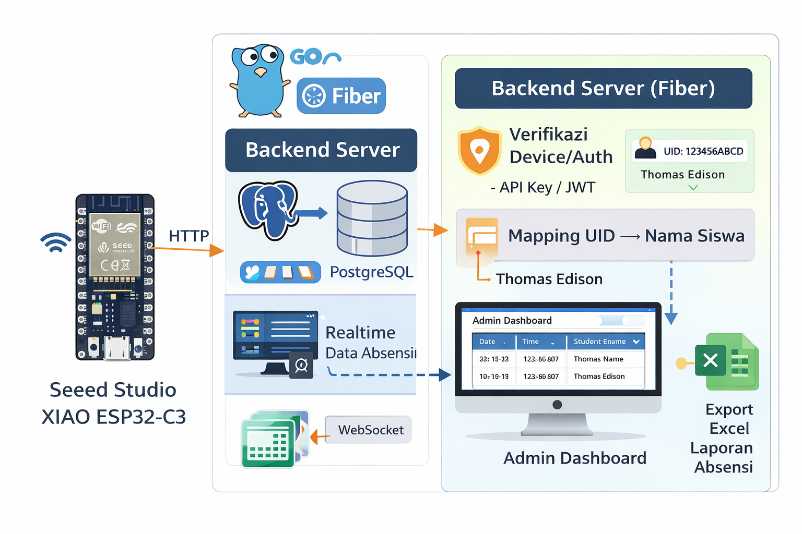

⏱️ Absen Online Dashboard & REST API (GO Fiber)
============================================

Repository ini berisi Dasboard & Backend REST API untuk sistem absensi RFID yang dibangun menggunakan bahasa Go dengan framework Fiber, ORM GORM, HTMX dan database PostgreSQL.
Aplikasi ini berfungsi sebagai pusat pengolahan data absensi yang dikirimkan oleh perangkat RFID berbasis XIAO ESP32-C3 setelah kartu RFID ditap oleh pengguna.

@Copyright 2025 maonks


Fungsi Utama Backend REST API
------------------------------

- Menerima push data absensi dari device RFID (HTTP API)
- Verifikasi & validasi data device
- Mapping UID kartu RFID → data siswa
- Menyimpan data absensi ke database
- Mengirim update realtime ke dashboard menggunakan WebSocket
- Menyediakan API untuk frontend dashboard
- Menghasilkan laporan absensi dalam format Excel


Alur Proses Project
--------------------

- Kartu RFID ditap ke reader
- XIAO ESP32-C3 mengirim UID ke backend via HTTP
- Backend:
          Memvalidasi device
          Mencocokkan UID dengan data siswa
          Menyimpan data absensi
- Data dikirim realtime ke frontend melalui WebSocket
- Admin melihat dashboard & mengunduh laporan Excel
  



Fitur Utama
------------

- 🚀 REST API cepat & ringan (Fiber)
- 🔐 Keamanan device (API key / HMAC / JWT)
- 📡 Realtime update menggunakan WebSocket
- 🧑‍🎓 Mapping kartu RFID ke nama siswa
- 📊 Dashboard data absensi
- 📅 Filter tanggal & riwayat absensi
- 📤 Export laporan ke Excel
- 🗄️ PostgreSQL sebagai database utama
- 🧩 Arsitektur modular & scalable


Arsitektur Dashboard
--------------------

```text
absen-rfid-dashboard/
├── main.go      # Entry point Arduino
├── README.md
│
├── config/                      # Konfigurasi device & environment
│   └──  database.go
│
├── controllers/                        # WiFi & HTTP client
│   ├── wifi_manager.c
│   ├── wifi_manager.h
│   ├── http_client.c
│   └── http_client.h
│
├── rfid/                        # Pembacaan kartu RFID
│   ├── rfid_reader.c
│   └── rfid_reader.h
│
└── utils/                       # Crypto, buzzer, helper
    ├── crypto.c
    ├── crypto.h
    └── buzzer.h

```

Teknologi yang digunakan
------------------------

- Golang
- Fiber
- GORM
- PostgreSQL
- WebSocket
- JWT Authentication
- Excel Export (XLSX)

  
Hardware yang Didukung
-----------------------

- Seeed Studio XIAO ESP32-C3
- RFID Reader (MFRC522 / kompatibel)
- Buzzer aktif
- Koneksi WiFi 2.4GHz


Cara Penggunaan Singkat (Arduino IDE)
-------------------------------------

- Clone / download repository
- Install postgreSQL
- Copy .ENV.example → .ENV
- run project di VSCODE
- go run main.go
- Testing menggunakan POSTMAN
